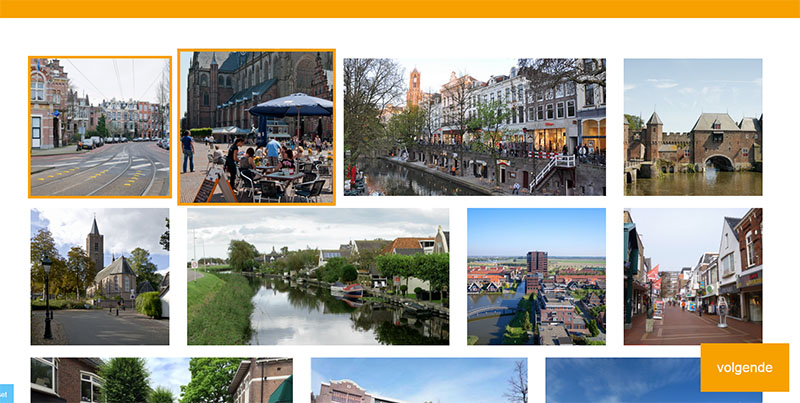
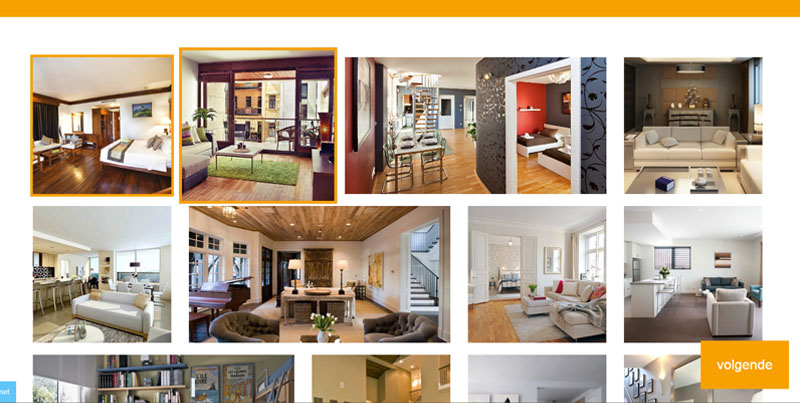
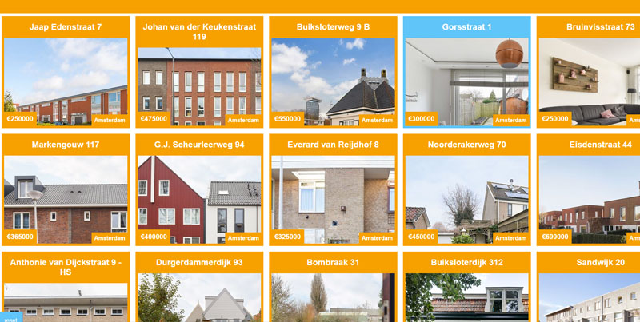
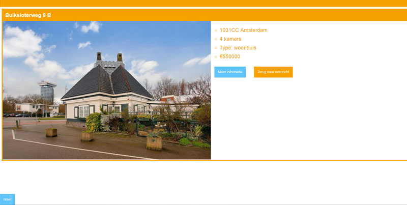

# Browser technologies: Funda web app

On this README.md I will describe my funda app in both it's appearance and functionality. See [RESEARCH-TODO.md](RESEARCH-TODO.md) for a progressive enhancement/accessibility test and fix wishlist for Browser Technologies.

[Progressive enhancement/accessibility rest and todo's](RESEARCH-TODO.md)

## Device Lab

### Android Phone

### Android Tablet

### E-reader

### Macbook Chrome

### Macbook Safari

### Older android tablet

## Screen reader analysis (NVDA)

Using screen reader software (NVDA) I tested the Funda application whilst blindfolded. This to simulate how it would be to browse the app without actually seeing it. To start of with the app was quite readable. At first I got a link saying 'start' and a description of the app. After tabbing to start and entering I got onto the actual app. The moodboard is made out of radiobuttons with certain names and values, because of this I was still able to navigate and use the app. The problem is that I couldn't actually see the images, so the purpose of the moodboard was a bit defeated. But still, the functionality worked. One issue was that I had to tab through all the images in order to get to the 'Next' button. This was quite a hassle. The overview page was clear and each block had it's headers correctly placed in the html. The same goes for the detailpage.

All in all the app worked quite well using the screen reader, but because of the visual concept you don't get the full experience. Maybe a solution to this is describing the actual images instead of plainly stating what they are (Describe the city instead of saying 'Amsterdam').

## The Funda app

When conceptualizing my web app prototype for Funda I wanted to create a filtering/search experience that spoke to people who didn't have a clear goal in mind yet. These are people who are still very much in the beginning stages of orientating.

The app gives you what I call a 'filter moodboard'. This is a set of images related to a specific subject. It could be neighborhoods, streets, cities, gardens or house interiors. For every selection users get to choose an image that speaks to their imagination. At the end of choosing users get a selection of houses based on what they liked. For example; Someone who picked images of a quiet tranquil neighborhood and vast living spaces would get a selection of houses that fit that criteria.

Example of a moodboard that let's the user select a city

Example of a moodboard that let's a user select their preferred house interior style

General results page

Detail page

[Progressive enhancement/accessibility rest and todo's](RESEARCH-TODO.md)
