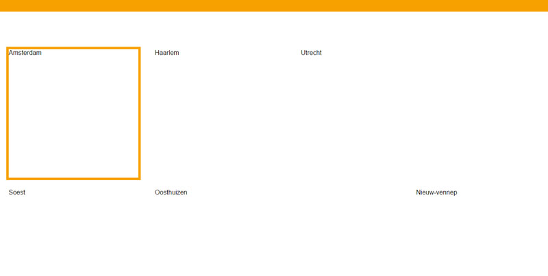

# Progressive enhancement/accessibility tests and todo's

## No images

### Progressive enhancement/accessibility

My web app relies heavily on the use of images. I tested what would happen if a user either couldn't load the images or chose to disable them using the browser.

My web app without images:

As we can see the app breaks in a serieus way. All that remains is the selection border around the boxes. Due to a height setting the boxes still keep their original size and the next buttons remains. The functionality remains intact - but without the images the user really has no idea what they're supposed to do and what their selection means. This has breaking effect on accessibility and it is clear that my progressive enhancement could've been better.

### TO DO (fixes)

The best way to fix this issue is to add fallback text to the images which let's the user know what value is behind each image. My app's concept is all about visualizing and choosing based on how you feel, but in the case of no images it's wise to have a fallback, even if it fundamentally changes the way my app works.

An example of how this looks after implementing it:

