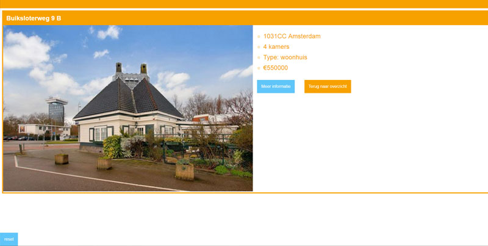

# Progressive enhancement/accessibility tests and todo's

## 1.No images

### Progressive enhancement/accessibility

My web app relies heavily on the use of images. I tested what would happen if a user either couldn't load the images or chose to disable them using the browser.

My web app without images:

As we can see the app breaks in a serieus way. All that remains is the selection border around the boxes. Due to a height setting the boxes still keep their original size and the next buttons remains. The functionality remains intact - but without the images the user really has no idea what they're supposed to do and what their selection means. This has breaking effect on accessibility and it is clear that my progressive enhancement could've been better.

### TO DO (fixes)

The best way to fix this issue is to add fallback text to the images which let's the user know what value is behind each image. My app's concept is all about visualizing and choosing based on how you feel, but in the case of no images it's wise to have a fallback, even if it fundamentally changes the way my app works.

An example of how this looks after implementing it:

## 2.Custom fonts

### Progressive enhancement/accessibility

My Funda app uses a standard sans-serif font. Turning off custom fonts means nothing changes for me. I've also avoided using any kind of icon font. If I did however user custom/icon fonts then the results could be a disjointed typography and no icons.

### TO DO (fixes)

Had I used custom/icon fonts then I'd make sure to have a fallback in place. Using the standard sans-serif font in place of my custom sans-serif font and adding images for icons instead of a font.

## 3.No Javascript

### Progressive enhancement/accessibility.

This is where things really start to get icky. My Funda app is a one page web app which means I used Javascript routes to get from 'page' to 'page'. Turning off Javascript means that i'm stuck on a view and can't continue further into the app. Every image choice adds a parameter to the api url and this doesn't happen without my Javascript. The lay-out does remain instact because it's built using html and css only.

### TO DO (fixes)

The best way to fix a fall back for someone who doesn't use Javascript is to change the app from a one pager to a normal website. Each click links to the next page and sends a submit form with it. This way users can still continue into the app. It's also wise to add a message stating that Javascript enabled gives users the best experience.

## 4.Color

### Progressive enhancement/accessibility.

My Funda app has a strong contrast between elements. If a text is white, than the background is a strong orange or blue. If the text is colored and I use a white background. Testing of several settings like colorblind mode and inverted colors(broken screens) the results are that the app is still quite readable. The main issue is that images lose some of their clarity and feel. My app is about getting a feel for a certain environment but different colors can have a strong impact on how something feels.

### TO DO (fixes)

A good way to deal with the risk of images losing their feel because of broken or different colors is to add a small description. So an image of a quiet neighborhood could have the description of "Calm, quiet neighborhood". It's also wise to make sure I keep the contrast between text, buttons and other elements and their background clear.

## 5.Broadband internet

### Progressive enhancement/accessibility.

When testing on a regular 2g network with 300ms the page takes up to 40 seconds to load because of the high use  of images. This means that the app isn't optimized for mobile devices that aren't on wifi or a good cellular connection.

### TO DO (fixes)

A sure fire way to fix the loading time it so compress images. Reduce their pixel ratio and quality to get a better file size. A blurring load could also help the perceived performance, the users get an idea of what they're waiting for.

## 6.Cookies

### Progressive enhancement/accessibility.

My Funda app doesn't make use of cookies. The idea is that the user gets a fresh and completely new experience every time they load the page. I expect users to use the moodboard several times to see different results. Had I used cookies then doing things like saving preferences on a device would be problematic to say the least.

### TO DO (fixes)

a way to fix preferences is to introduce an account system or let users connect with their Funda/Facebook account. Preferences would be stored on a database instead of on a users device. If a user does support cookies though, this would only be a fallback.

## 7.Localstorage

### Progressive enhancement/accessibility.

My Funda app doesn't make use of localstorage. The idea behind the app is that the user get's a new selection of images which are dynamically gathered on every load. This means it would be a waste to save images on localstorage as they would never be used again. However, localstorage could proof useful in saving favorite houses or results. If this was the case then the saving function wouldn't work based on localstorage had a user turned it off.

### TO DO (fixes)

As with cookies, a way to fix this is with an account which is either Facebook connected or through a Funda account.

## 8. Mouse/Trackpad

### Progressive enhancement/accessibility.

My Funda app always has one main action. During the moodboard phase this means choosing an image and then moving on to the next button. All the images connected to radiobuttons through a label, this means that they act as such. With a tab you get to the first image and using the arrow keys you can continue to move between images. When you're done press tab to move on to next. At the overview page you can tab to select each individual house. It's quite clear what's selected at any time due to the design of the focus statues. But the arrows instead of tabbing at the radiobuttons can be confusing to some.

### TO DO (fixes)

Radiobuttons are controlled with arrow keys, this is how html works. Changing this forcefully is not a clean solutions so there's two things I could do:

* Change the radiobuttons to links or checkboxes
* Have instructions on the page for how the tabbing works

# Conclusion

All in all there is still a lot that could be improved on in terms of progressive enhancement and accessibility. My Funda web app relies heavily on images but this doesn't mean that the app should be worthless to someone on a terrible connection, or someone who can't see. Adding things like clear alt tags to images and descriptions still keeps the inner workings of the app in tact and provides a useful interaction for the user. There are also quite some technical changes that can be made, like making sure that the app can work without Javascript. Right now the page is a one page web app but we have to allow links and multiple pages if needed.

## Summed up TO DO / Wishlist

* Text as fallback for images
* San-seris fallback font and no icon fonts
* If Javascript fails use pagelinks and formsubmit to continue within the app
* Strong contrast between backgrounds and elements, also add description to images
* Compress and reduce image file size
* If cookies or localstorage fails, use an external database connected to a account
* Change radiobuttons to links or add extra description on how tabbing works

[Back to README.md](README.md)
